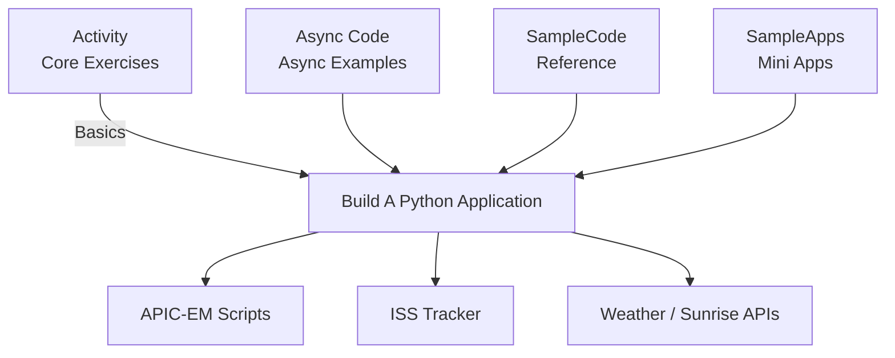

# 📘 Programming for Networks & Information Security

*Python • Network Automation • JSON/XML • APIs • Security Scripting*


---

## 📖 Overview

This repository is a collection of exercises and small examples for learning **Python in the context of networking and information security**.

The material moves from basic Python syntax to more practical tasks, such as:

- working with files
- parsing JSON and XML
- using APIs (e.g. ISS tracking, weather data, Cisco APIC-EM)
- writing small scripts that could be useful in network and security work

The idea is that you can open almost any folder, pick a file, and learn one focused thing at a time.

---

# 📂 Repository Structure

## 1. `Activity/` — Core Learning Exercises

This folder contains the main step-by-step exercises. They start from very simple scripts and gradually introduce more realistic data and tasks.

Included topics:

- Python basics (variables, lists, dictionaries, loops, functions)
- File input/output
- JSON parsing in several stages
- XML parsing
- Simple networking-related data structures
- Basic error handling

You can usually run these directly with:

```bash
python Activity/some_script.py
````

---

## 2. `Async Code/` — Asynchronous Networking Examples

Short examples showing how to use `async/await` for tasks such as fetching data over the network.

These files are there mainly to introduce the idea of asynchronous programming and to show how it might be useful in automation scripts.

---

## 3. `Build A Python Application/` — Small Applications

This folder contains more complete scripts that combine several concepts:

* Weather application using a public API
* Sunrise/sunset calculator
* ISS (International Space Station) tracker in different versions
* A small “any API” app template you can adapt to other services
* Cisco APIC-EM examples for network automation

There are also helper modules, for example:

* `my_apic_em_functions.py` — functions for talking to APIC-EM
* `get_ticket.py` — obtains an auth ticket from the controller
* `print_devices.py` / `print_hosts.py` — simple scripts to list devices and hosts

Some scripts use images (`iss.gif`, `map.gif`) to visualize data, for example the ISS on a map using Turtle graphics.

---

## 4. `SampleCode/` — Reference Snippets

This folder is more like a “code notebook”. It includes small, focused examples you can look at when you forget syntax or want a minimal reference.

Examples:

* JSON reading and writing
* XML parsing
* File handling
* Loops and conditionals
* Simple functions and data structures used in networking-style problems

These are good to skim if you need a quick reminder of how to do something in Python.

---

## 5. `SampleApps/` — Small Complete Programs

Here you’ll find a few self-contained applications that are slightly more polished than the raw examples:

* a basic weather API client
* an ISS location viewer
* a simple network device viewer

They are meant as demonstrations of how you can turn the techniques from `Activity/` and `SampleCode/` into small tools.

---

## 6. `Test/` — Input Files for Exercises

This folder contains text files and other small resources used by some of the exercises, for example:

* files for practicing reading/writing
* files used to trigger error handling

You normally don’t run anything from here directly; the files are read by scripts in other folders.

---

# 🧭 How the Pieces Fit Together

The folders are meant to build on each other:

```text
Programming-for-networks-and-information-security
│
├── Activity/
│   ├── Basics → variables, lists, dicts
│   ├── Control Flow → if, while, functions
│   ├── File I/O → read/write
│   ├── JSON → parsing stages (1–7)
│   └── XML → XML examples 1–4
│
├── Async Code/
│   └── async data fetching examples
│
├── Build A Python Application/
│   ├── API Apps
│   │   ├── Weather
│   │   ├── Sunrise/Sunset
│   │   └── ISS Tracker (basic/input/turtle)
│   ├── APIC-EM network automation
│   │   ├── get_ticket.py
│   │   ├── my_apic_em_functions.py
│   │   └── print_devices / print_hosts
│   └── helper files + GIF assets
│
├── SampleCode/
│   └── reference examples (JSON/XML/loops/functions)
│
└── SampleApps/
    └── small finished applications
```

---

# 🎨 Mermaid Diagram — Folder Relationships



---

# 🚀 Running the Code

### Prerequisites

* Python **3.8+**
* Some scripts require the `requests` library:

```bash
pip install requests
```

### Examples

Print network devices from APIC-EM:

```bash
python "Build A Python Application/print_devices.py"
```

Run one of the ISS tracking examples:

```bash
python "Build A Python Application/1_3_4_3_Option_3_Create_an_App_for_the_ISS.py"
```

Run a JSON exercise from `Activity/`:

```bash
python Activity/08_json-parse3.py
```

---

# 🛠 Technologies Used

* Python 3
* JSON / XML (standard libraries)
* REST APIs (with `requests`)
* Turtle graphics (for simple visualizations)
* `asyncio` for asynchronous examples

---

# 📌 What This Repository Is For

This repository is meant for:

* students learning Python with a networking/security angle
* people new to automation who want small, concrete examples
* anyone who prefers short scripts over large frameworks while learning

The focus is on **understanding what the code does** rather than building production-grade tools.

---

# 📜 License

Intended for educational and training use.
Check your course instructions or local policy if you plan to reuse or share parts of the material.
